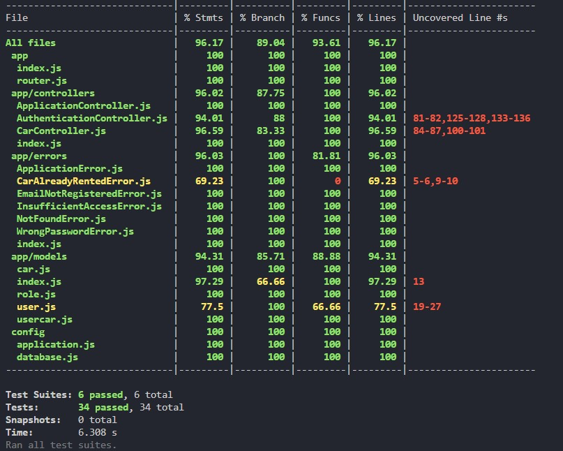

# BCR API

Di dalam repository ini terdapat implementasi API dari Binar Car Rental.

## Langkah-langkah

1. Clone repository ini
2. Isi variabel pada file .env sesuai kebutuhan
3. Management database

## Management database

1. `npm run db: create` untuk membuat database
2. `npm run db: migrate` untuk menjalankan migration database
3. `npm run db: seed` untuk menjalankan seeding database
4. `npm run db: drop` untuk membuat database

## Menjalankan server backend

```
npm start
```

## Menjalankan testing

```
npm run test
```

## Unit testing



## Deploy netlify

[https://yngr-unit-test-jest.netlify.app/](https://yngr-unit-test-jest.netlify.app/)
